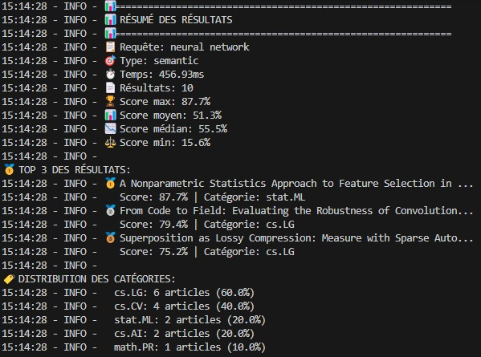
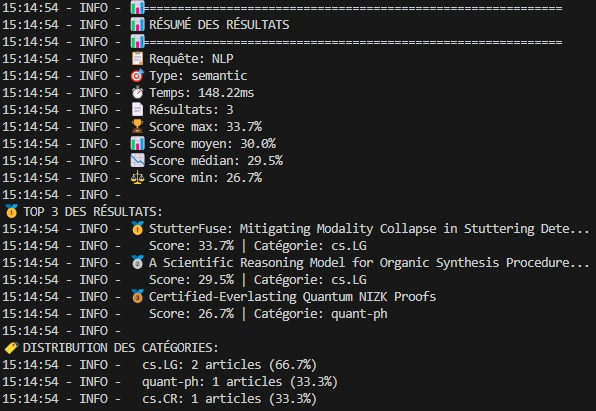
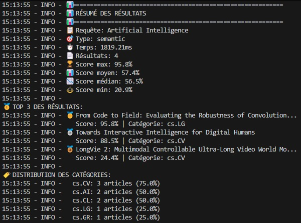

# Scientific Semantic Search: *ScholarSearch*

## Base documentaire intelligente pour articles scientifiques avec recherche sémantique utilisant Elasticsearch et Sentence-BERT.

## 1. Objectif
Le projet vise à créer un moteur de recherche sémantique capable de comprendre le sens des requêtes, au-delà des simples mots-clés.
Exemple : Une recherche pour "réseaux de neurones profonds" peut retourner des articles contenant "deep learning", même si ces mots exacts n’apparaissent pas dans la requête.

## 2. Architecture
*Le système est composé de 4 grands blocs :*
***Collecte de données** : récupération des articles scientifiques depuis arXiv, nettoyage et structuration en JSON.*
***Cerveau IA (Sentence-BERT)** : transformation des titres et abstracts en embeddings (vecteurs numériques capturant le sens du texte), calcul de similarité cosinus, et clustering thématique.*
***Base de données intelligente (Elasticsearch)** : stockage des articles et de leurs embeddings pour une recherche rapide et pertinente.*
***Interface utilisateur (React / Tailwind CSS)** : page web simple avec barre de recherche et affichage des résultats pertinents

## 3.  Équipe 
- [Bahamd Imane](https://github.com/imanebahamd)
- [Fadyl Ezzahra](https://github.com/EzzahraF)
- [Khalloufi Yousra](https://github.com/yousra-kh9)

## 4. Technologies utilisées
### Backend & Base de données
***Python** : scripts de traitement et API*
***FastAPI** : API REST pour la recherche*
***Elasticsearch** : stockage d’articles et recherche vectorielle*

### AI & ML
***Sentence-BERT (all-MiniLM-L6-v2)** : génération d’embeddings pour capturer le sens des textes*
***NumPy / Pandas** : manipulation des données*
***Scikit-learn** : clustering thématique avec K-Means*

### Frontend
***React + Tailwind CSS** : interface utilisateur interactive*

### DevOps
***Docker** : conteneurisation*

## 5. Fonctionnement
### 5.1 Préparation des données
- *Récupération des articles depuis arXiv*
- *Nettoyage et structuration en JSON*
- *Génération des embeddings avec Sentence-BERT*
```
from ai.embeddings.sentence_bert_handler import SentenceBERTHandler
handler = SentenceBERTHandler(model_name="all-MiniLM-L6-v2")
embeddings = handler.encode(list_of_texts)
```
### 5.2 Stockage dans Elasticsearch
- *Création d’un index avec mapping pour les champs textes et vecteurs*
- *Import des articles + embeddings*
### 5.3 Recherche sémantique
*L’utilisateur saisit une requête ----> Requête transformée en embedding ----> Calcul de similarité cosinus avec les articles----> Retour des Top-10 articles les plus pertinents*
### 5.4 Clustering thématique
- *Regroupement automatique des articles similaires en thèmes*
- *Permet de visualiser les domaines dominants dans le corpus*
## 6. Installation
**Pré-requis**
- Python 3.10+
- Node.js 18+
- Docker (optionnel pour tout containerisé)
**Lancer le backend**
```
pip install -r backend/requirements.txt
python backend/elasticsearch/process_and_import.py
uvicorn backend.api.routes_simple:app --reload
```
**Lancer le frontend**
```
cd frontend
npm install
npm run dev
```
**Avec Docker**
```docker-compose up --build```

## 7. Démonstration

### 6.1 Captures d'écran
#### Recherche : Neural Network


#### Recherche : NLP


#### Recherche : Artificial Intelligence


### 6.2 Vidéo de démonstration
[Voir la démo vidéo](docs/Video_demo/video_demo.mp4)
